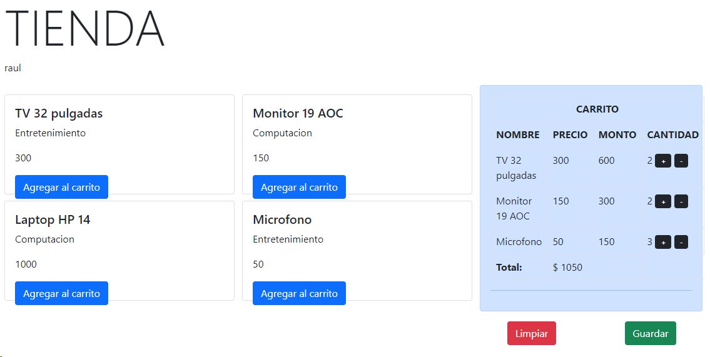

## Aplicación de Carrito de Compras 

Carrito de Compras realizado en Django

**Nota:** *Para la totalización se requiere que el usuario este Loggueado*

| BackEnd | FrontEnd | Repositorio de Datos |
|-|-|-|
| Django  | Jinja, Boostrap y Html | SQLite3 |

---

Paqueteria Utilizada en Django

| Paquete | Versión |
|-|-| 
| Django | 4.2.6 |
| Pillow | 10.1.0 |

---

---

|Raúl Ibáñez M.|
|-------------------------|   
